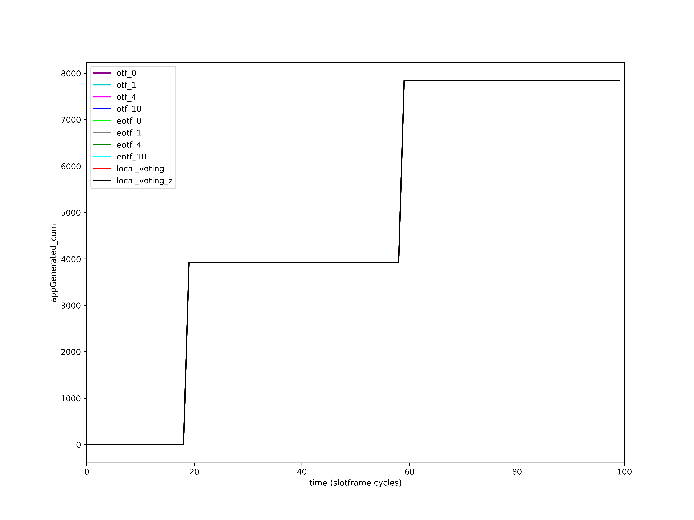
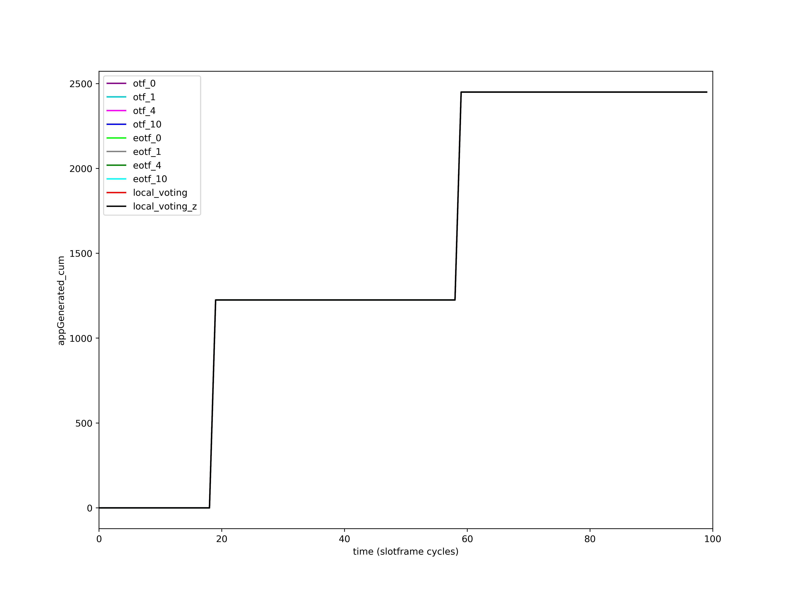

Local Voting TSCH
=================

Implementation of the Local Voting algorithm in the 6TiSCH Simulator, and some
simulation results. Comparison of Local Voting with OTF, thresholds 0,1,4,10,
1,2, and 3 parents, 100 buffer size, and 5 25 50 80 packets per burst.

You can find eps and png figures of the results in folder bin/simData/

Some indicative results:

Table of Contents
=================

[TOC]

Aggregated Values vs parameters
===============================

### time_all_root

### max_latency

### latency

### chargeConsumedPerRecv

### chargeConsumed

### reliability

### max_txQueueFill

### txQueueFill

### LoadAllG

### LoadAllJain

### LoadCongG

### LoadCongJain

Some indicative scenarios
===================

Scenario parents: 3, packets: 80
------------------------------
### appGenerated_cum

### appReachesDagroot_cum

### appReachesDagroot

### chargeConsumed

### latency

### numRxCells

### txQueueFill

### LoadAllG

### LoadAllJain

### LoadCongG

### LoadCongJain

Scenario parents: 3, packets: 50
------------------------------
### appGenerated_cum

### appReachesDagroot_cum

### appReachesDagroot

### chargeConsumed

### latency

### numRxCells

### txQueueFill

### LoadAllG

### LoadAllJain

### LoadCongG

### LoadCongJain

Scenario parents: 3, packets: 25
------------------------------
### appGenerated_cum

### appReachesDagroot_cum

### appReachesDagroot

### chargeConsumed

### latency

### numRxCells

### txQueueFill

### LoadAllG

### LoadAllJain

### LoadCongG

### LoadCongJain

Scenario parents: 3, packets: 5
------------------------------
### appGenerated_cum

### appReachesDagroot_cum

### appReachesDagroot

### chargeConsumed

### latency

### numRxCells

### txQueueFill

### LoadAllG

### LoadAllJain

### LoadCongG

### LoadCongJain

Code Organization
-----------------

* `bin/`: the script for you to run
* `SimEngine/`: the simulator
    * `Mote.py`: Models a 6TiSCH mote running the different standards listed above.
    * `Propagation.py`: Wireless propagation model.
    * `SimEngine.py`: Event-driven simulation engine at the core of this simulator.
    * `SimSettings.py`: Data store for all simulation settings.
    * `SimStats.py`: Periodically collects statistics and writes those to a file.
    * `Topology.py`: creates a topology of the motes in the network.
* `SimGui/`: the graphical user interface to the simulator

Issues and bugs
---------------

* Report at https://bitbucket.org/6tsch/simulator/issues
